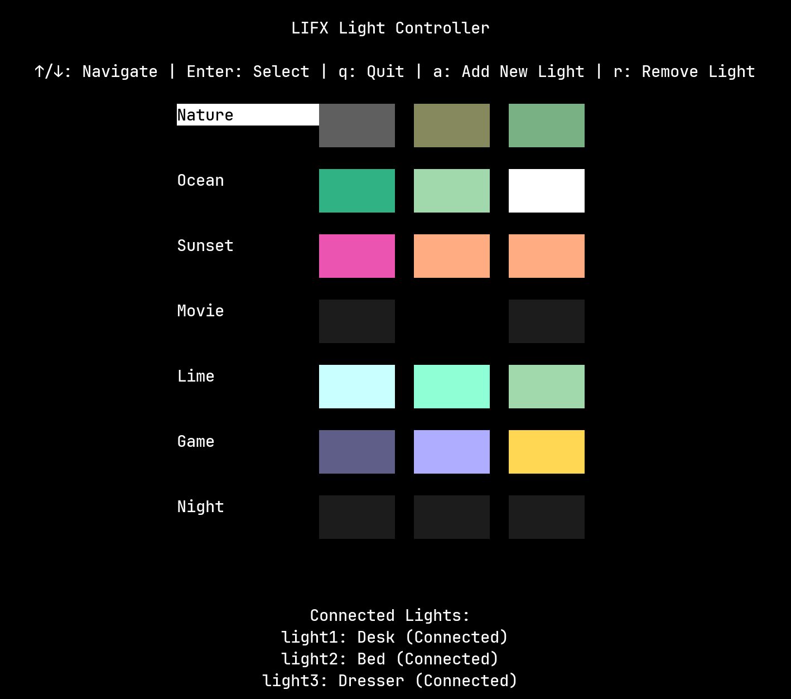

# LIFX Light Controller 🌈
[](https://www.python.org/downloads/)
[](https://opensource.org/licenses/MIT)

A powerful, terminal-based controller for LIFX smart lights featuring an intuitive Text User Interface (TUI) and scene management system.



## ✨ Features

- **Intuitive TUI Interface**: Navigate and control your lights with ease
- **Scene Management**: Pre-configured scenes for any mood or occasion
  - 🌿 Nature
  - 🌊 Ocean
  - 🌅 Sunset
  - 🎬 Movie
  - 🍋 Lime
  - 🎮 Game
  - 🌙 Night
- **Dynamic Light Control**: Add or remove lights through the interface
- **Persistent Configuration**: Automatically saves your light setup
- **Command Line Support**: Quick access to common functions
- **Real-time Color Preview**: Visual representation of scenes
- **Error Handling**: Robust error management and user feedback

## 🚀 Getting Started

### Prerequisites

- Python 3.8 or higher
- LIFX lights on your local network
- Terminal with 256-color support

### Installation

1. Clone the repository:
```bash
git clone https://github.com/CodeByJared/LIFX-TUI.git
cd lifx_controller
```

2. Install required packages:
```bash
pip install -r requirements.txt
```

### Usage
- **TUI Mode**

- **Controls**

- **Command Line Mode**

### Available Scenes

| Scene | Description | Colors |
|--------|-------------|---------|
| 🌿 Nature | Earthy, calming tones | Dark Brown, Moss Green, Jade |
| 🌊 Ocean | Cool, aquatic atmosphere | Sea Green, Celadon, White |
| 🌅 Sunset | Warm, evening ambiance | Mulberry, Tangerine, Yellow |
| 🎬 Movie | Cinema-optimized lighting | Dim Black, Off, Dim Black |
| 🍋 Lime | Fresh, energetic feel | Mint, Light Green, Sage |
| 🎮 Game | Gaming-optimized lighting | Blue, Vista Blue, Saffron |
| 🌙 Night | Gentle, evening mode | Soft Black (which is really white) across all lights |

### TODO
- Instructions for TUI Mode, Controls, CLI Mode
- Make scenes have a dynamic mode
- Better real-time color preview
- AUR package (Coming soon?)